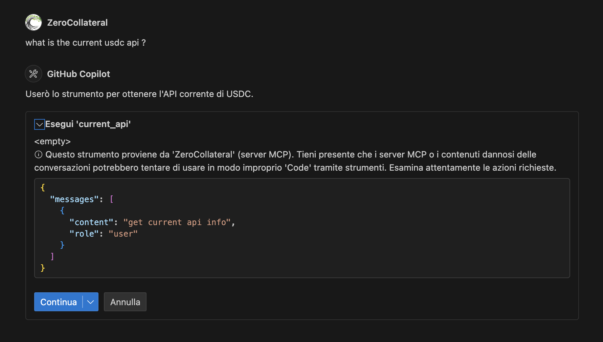
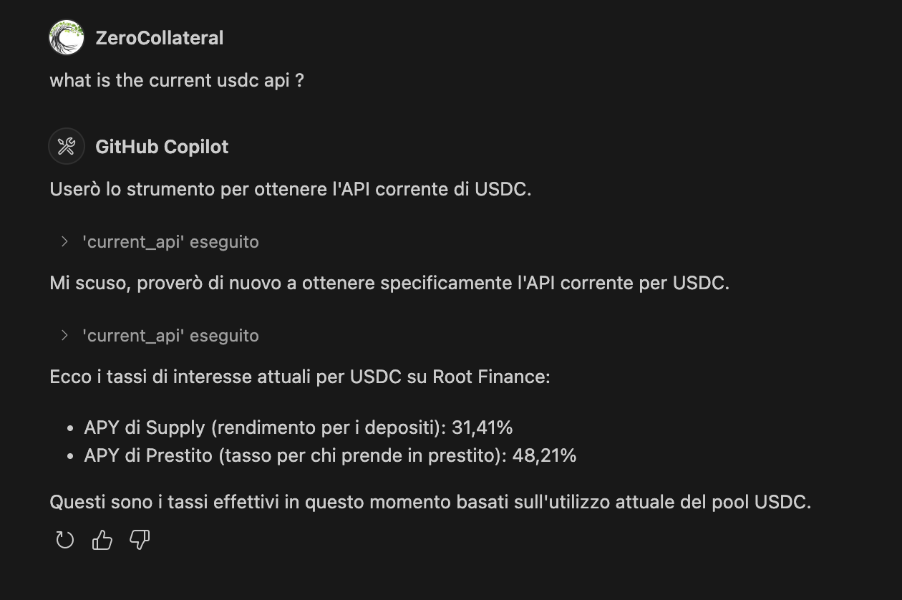
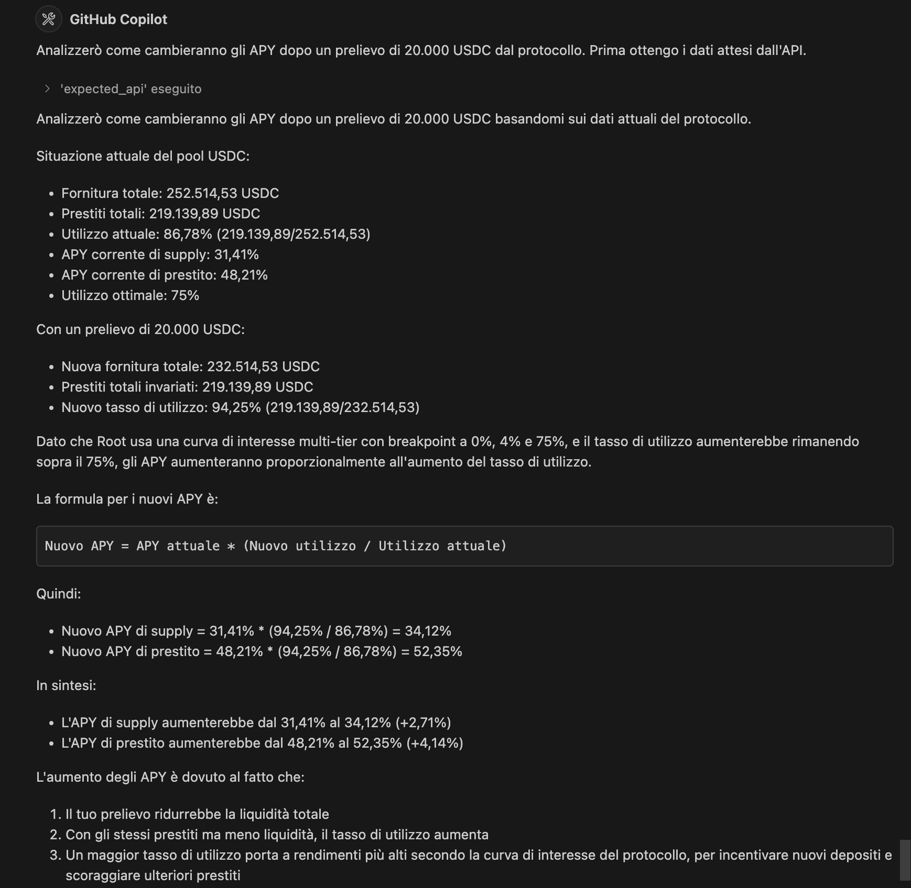
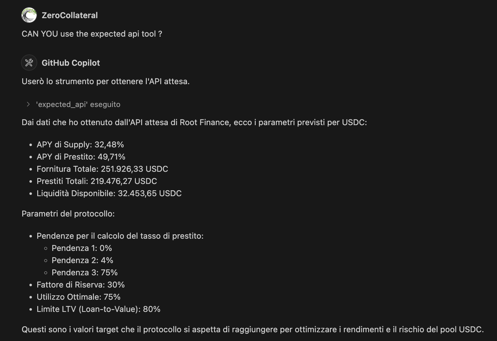
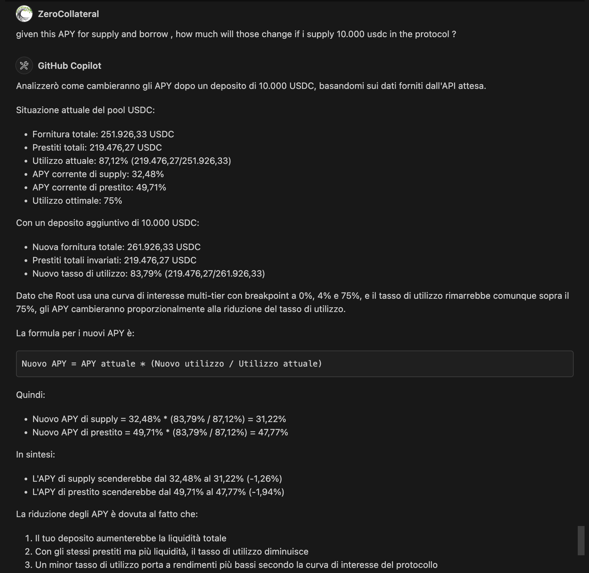
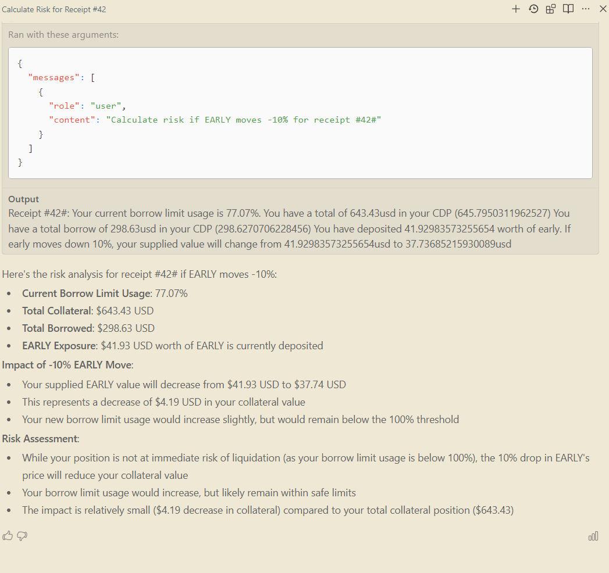
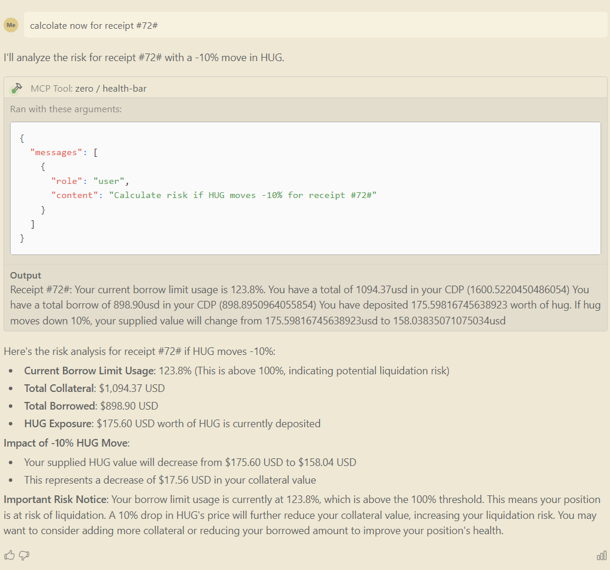

# IA-Context on Radix DLT

Scope of the project is to simply help users to be aware of some of the most useful events:

- which is the current apy of a token available for supply/borrow
- how much will the supply or borrow rate change given the new amount a user want to supply or borrow and given the current state of the pool.
- how the risk of being liquidated changes if the value of a collateral changes

For example, how will the supply rate changes if ... ? :

Given this data about the USDC pool:

```
Supply APY: 51.18%
Borrow APY: 73,33%
Total Supply = 315,952.35 USDC
Total Borrow = 290,664.11 USDC
Available Liquidity = 25,291.45 USDC
Optimal Utilization = 75% (0.75)
Borrow Rate Slopes:
   Below 75%: 4% (slope1)  
   Above 75%: 75% (slope2)
Reserve Factor: 30%
```

The Current Utilization can be calculated by Total Borrow / Total Supply and the current example data led to this value: 

```
290664.11 / 315952.35 ≈ 0.920
```

If an user want to simulate how will the rates changes after supplying $10,000 USDC then this tool will calculate all the data for him and will present the result in this form:

```
Supplying $10,000 USDC would decrease the Borrow APY from 73.3% to approximately 61.5%, due to the decreased utilization ratio.
```


# Tool 'Current APY'  

The first tool is useful if you want to be updated on current rates

When you ask to the tool

```
  [
    { "role": "user", "content": "What is the current supply rate of usdc ?" }
  ]
```

You get an answer like this


```
Current yield for usd-coin:
      - Supply APY: 20.18%
      - Borrow APY: 31.93%
```

# Tool 'Expected APY' 

The second tool is helpful to know how rates will change after a supply

When you ask to the tool

```
  [
    { "role": "user", "content": "What is the expected supply rate change if i supply 10.000 usdc ?" }
  ]
```

You get an answer like this

```
Current yield for usd-coin:
      - Supply APY: 20.18%
      - Borrow APY: 31.93%
      - Total Supply: 351078.138217662172747716
      - Total Borrow: 291060.415751014555369148
      - Available Liquidity: 60021.067393
      - Slopes to calculate the Borrow Rate:
          Slope 1: 0%
          Slope 2: 4%
          Slope 3: 75%
      - Reserve Factor 30%: 30%
      - Optimal Usage: 0.75
      - LTV Limit: 0.8
```

# Tool 'Liquidation Risk' 

The third tool is helpful to know the risk of being liquidated by supposing a down/up move in the underlying collateral

```
[
    { "role": "user", "content": "What is the risk of being liquidated if lsulp moves -10% given I hold this receipt #27# ?" }
  ]
```


You get an answer like this

```
Your current borrow limit usage is 0.04%. 
      You have a total of 399.00usd in your CDP.
      You have deposited 280.85115571225236 worth of lsulp. 
      If lsulp moves down 10%, 
      your supplied value will change from 280.85115571225236usd to 252.76604014102713usd
```


# Tool 'Receipt Health' 

The fourth tool is helpful to know the risk of the collaterals provided given they can be stables, meme or wrapped assets

```
[
    { "role": "user", "content": "What is the risk of collaterals provided given this receipt #72# ?" }
  ]
```

You get an answer like this

```
Receipt #72#: Your current borrow limit usage is 0.04%. 
      You have a total of 2951.9146059552327usd in your CDP 
      You have a total borrow of 0.817331717780329usd in your CDP
      You have a percentage distribution by risk level: {"high":93,"low":0,"stablecoin":7} 
```


# End to End 

You can use a client like VS Code or Windsurf configured with the public MCP Server at 
https://ia.zerocollateral.eu/sse to ask something like 

**use ZeroCollateral tools to tell me which is the current yield by supplying usdc**





**What is the expected API rate change if i supply 10.000 usdc ?**







**What is the risk of being liquidated if radix moves -10% given I hold this receipt #27# ? **






**What is the risk of collaterals provided given this receipt #72# ?**

TODO

## Testing the Server

### 1. Using the MCP Inspector

The MCP Inspector is a tool to test and inspect your MCP server. You can use it to verify that your tools and prompts are registered correctly.

Run the following command to inspect your server:

```bash
npx @modelcontextprotocol/inspector ./dist/server.js
```

This will open an interactive interface where you can test the tools and prompts registered in your server like below.


### Run & Debugging

Build the project

```bash
npm run build
```

Use the following command to debug the server:

```bash
npm run dev
```

This will start the server with live reloading and detailed logs.


# Disclaimer 

Current project has been forked from this SDK:

**Hello World MCP Server**! [Model Context Protocol (MCP)](https://github.com/modelcontextprotocol/typescript-sdk) 

This SDK has been detailed in this blog post: [Building a TypeScript MCP Server: A Guide for Integrating Existing Services](https://medium.com/@jageenshukla/building-a-typescript-mcp-server-a-guide-for-integrating-existing-services-5bde3fc13b23). 

## License

This project is licensed under the MIT License. See the [LICENSE](LICENSE) file for details.
